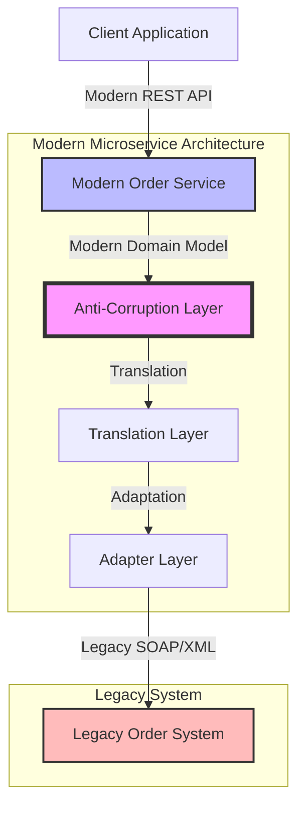

# Anti-Corruption Layer dummy example
This is an example of an ACL using Go.

### Context fictional
Let's say we're modernizing a legacy e-commerce system, where we need to integrate a modern microservice with a legacy monolithic order management system.  
  

  
### Layers description
Each layer serves a specific purpose:

`ModernOrderService`: Provides clean interface for modern applications  
`LegacyOrderAdapter`: Handles communication with legacy system  
`OrderTranslator`: Manages data format conversions  
`LegacyOrderService `: Represents the external legacy system  